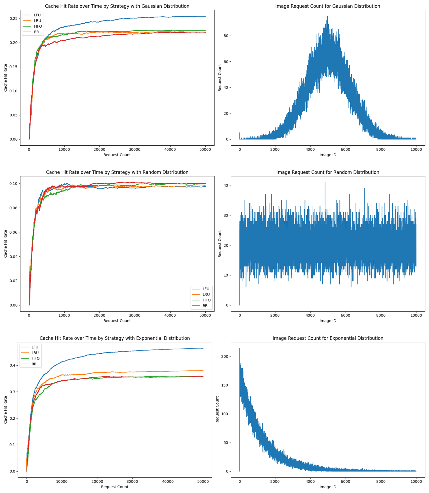

# Distributed Image Caching System - Client

This project is part of the university course for distributed system. It is the client side of a distributed image caching system. By Ben Schlauch.

## Summary
This project is a sequential application that emulates a "user". This user (the "main.py" script) will request images through the "client".     
The client consists of the client itself (client.py) and a cache (cache.py). The client will request images from the server, and the cache will store the images if needed locally (client-side). There are multiple cache strategies implemented in the cache.py file.
Features:
- Multiple caching strategies: LRU, LFU, FIFO, Random
- Async requests to the server for a lot of requests in a short time
- visualisation of the cache hit rate and request times
- user simulation according to different distributions   

Via the main.py the request times and the cache hit rate is measured and displayed in plots / the console.

## Installation

1. Clone the repository / put the files into a folder
2. if needed, create a virtual environment: `python3 -m venv venv` and activate the virtual environment: `source venv/bin/activate`     
! Tested on python 3.11!
3. install the requirements: `pip install -r requirements.txt`
4. Make sure you are connected to the internet / distributed system and the correct IPs are set in the main.py file. For local testing, just enter a local file path and set every flag to debug.
5. Run the main.py file: `python main.py`

## Results

More about the results can be read in our PDF file. Also check out the plots in the image 